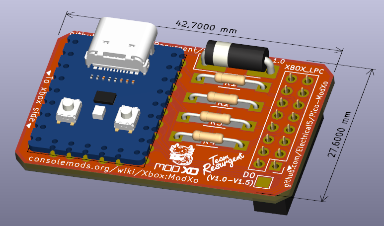
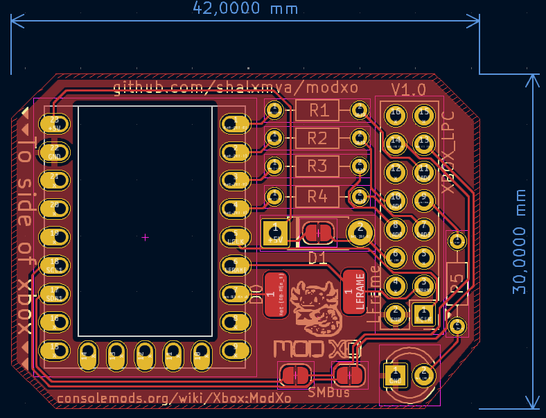
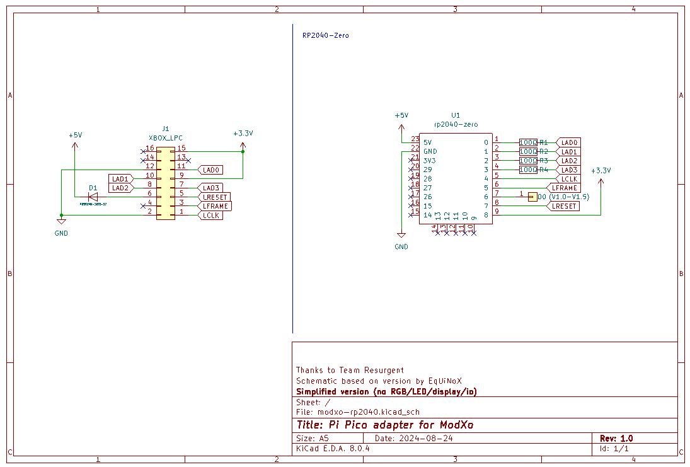
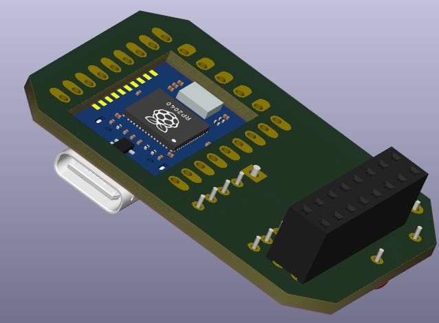

# ModXo adapter board for RP2040-Zero / RP2040-Tiny
Unofficial board for the original Xbox modchip "[ModXo](https://github.com/Team-Resurgent/Modxo)" by Team Resurgent.

* Using the smaller (USB-C) version RP2040-Zero by WaveShare.
* Cut-out in the middle of the PCB to allow the RP2040 to lay flush / improve cooling.
* Using both universal footprints to support both SMD and THT for easier soldering / finding parts.
* Single-sided PCB for easier manufacturing.

See the [Release V0.2](https://github.com/Electrical5/ModXo-RP2040-Zero/releases/tag/V0.2) for the 'old' board.

# Parts
- 4x 100Ω resistor
- 1x RP2040-Zero (WaveShare)
- Diode to protect when both PC and XBox are connected. (Optional)

# Notes
On 1.6 you will need to rebuild LPC before being able to install a modchip.
On 1.0-1.5 you will need to use D0 (solder pad on board).

# Fully open source

The KiCad (free application) source files (full schematics!) are included, so you can add/remove components based on your preferences.

# Cutout for RP2040-Zero

The RP2040-Zero has components on the back of the board, to allow for easier installation, there's a cutout in the board.
Though do note you can also install the RP2040-Zero using headers:

# License

GNU GENERAL PUBLIC LICENSE
Version 3, 29 June 2007

You can sell this board as-is, but disclose the source.
If you sell modifications of this board (additional headers for LED strips / LCD / fan), share the modifications / source files under the same license.

# More info

https://github.com/Team-Resurgent/Modxo

https://consolemods.org/wiki/Xbox:ModXo
